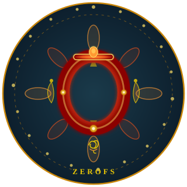

# ZeroFS CSI Driver

[](https://github.com/sorend/csi-driver-zerofs/actions/workflows/build.yaml)
[](https://github.com/sorend/csi-driver-zerofs/releases/latest)

<p align="center">
  
</p>

> **Work in progress.** Vibe coded, currently being tested since 3 months, but probably not for production use.

A Kubernetes CSI driver that provides persistent storage backed by S3-compatible object storage via [ZeroFS](https://github.com/barre/zerofs). Volumes are served over NFS (ReadWriteMany) or 9P (ReadWriteOnce).

## Quick Start with MinIO

### 1. Deploy the CSI driver and MinIO

```bash
kubectl apply -f https://github.com/sorend/csi-driver-zerofs/releases/latest/download/install.yaml
kubectl apply -f https://github.com/sorend/csi-driver-zerofs/releases/latest/download/minio.yaml
```

`install.yaml` creates the `zerofs-csi` namespace, the CSI controller/node, and a default credentials secret (`minioadmin` / `minioadmin123`).

### 2. Apply StorageClasses

The example StorageClasses are provided separately. Apply the defaults or use them as a template for your own configuration:

```bash
kubectl apply -f https://github.com/sorend/csi-driver-zerofs/releases/latest/download/storageclasses.yaml
```

This creates two StorageClasses: `zerofs-nfs` (NFS, ReadWriteMany) and `zerofs-ninep` (9P, ReadWriteOnce), both pointing at the MinIO instance deployed above.

Release manifests downloaded from `releases/latest/download` are pinned to the newest tagged CSI driver image when the release is published.

### 2. Create the bucket

```bash
kubectl wait -n zerofs-csi deployment/minio --for=condition=Available --timeout=60s
kubectl exec -n zerofs-csi deployment/minio -- \
  sh -c 'mc alias set local http://localhost:9000 minioadmin minioadmin123 && mc mb local/zerofs-data'
```

### 3. Use it

Create a PVC using the `zerofs-nfs` StorageClass (NFS, ReadWriteMany):

```yaml
apiVersion: v1
kind: PersistentVolumeClaim
metadata:
  name: my-pvc
spec:
  accessModes: [ReadWriteMany]
  storageClassName: zerofs-nfs
  resources:
    requests:
      storage: 10Gi
```

Or use `zerofs-ninep` for 9P (ReadWriteOnce).

## StorageClass Parameters

| Parameter | Description | Default |
|-----------|-------------|---------|
| `storageUrl` | S3 URL, e.g. `s3://zerofs-data` | — |
| `awsSecretName` | Secret with `awsAccessKeyID` / `awsSecretAccessKey` | — |
| `awsEndpoint` | S3 endpoint URL | — |
| `awsAllowHTTP` | Allow non-HTTPS endpoint | `true` |
| `protocol` | `nfs` or `ninep` | `nfs` |
| `encryptionPassword` | Encryption key for data at rest | `default-zerofs-encryption-key` |
| `cacheSizeGB` | Local cache size in GB | `10` |

Credentials must come from a Secret (raw keys in parameters are ignored).

## Uninstall

```bash
kubectl delete -f https://github.com/sorend/csi-driver-zerofs/releases/latest/download/storageclasses.yaml
kubectl delete -f https://github.com/sorend/csi-driver-zerofs/releases/latest/download/install.yaml
```

## Releases

Tagged releases are published to GHCR with GoReleaser. Pushing a `v*` tag publishes the multi-arch image to `ghcr.io/sorend/csi-driver-zerofs:<tag>`, updates `ghcr.io/sorend/csi-driver-zerofs:latest`, and attaches version-pinned Kubernetes manifests (`install.yaml`, `storageclasses.yaml`, `examples.yaml`, and `minio.yaml`) to the GitHub release.

## License

Apache License 2.0
